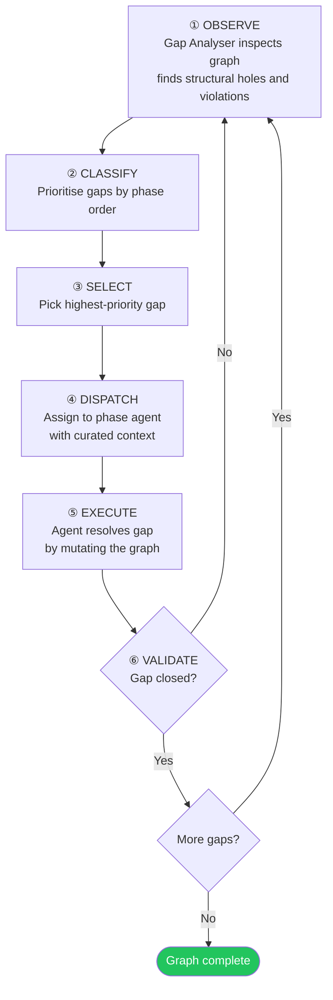

# FORGE — Architectural Whitepaper

## An Agentic Software Engineering Platform

---

## Abstract

FORGE is a persistent, locally-hosted agentic platform that transforms a
user-supplied whitepaper into a fully traced, tested, and deployable software
system. Its organising structure is the **Project Graph** — a single-rooted
tree where every artefact from source paragraph to passing test result is a
node with a stable identity and typed relationships. Its engine is the
**Observe-Act Loop** — a continuous cycle that inspects the graph for gaps,
dispatches AI agents to resolve them, and re-scans until the graph is complete.

The system scales to hundreds of modules and thousands of requirements while
maintaining full bidirectional traceability. A single engineer, amplified by
capable agents, can direct the construction and maintenance of genuinely
complex software — not by working faster, but by making coordination,
consistency, and traceability cost nothing.

---

## 1. The Central Problem

Software engineering at scale is a coordination and consistency problem, not a
typing problem. AI coding assistants have made producing code cheap. What
remains expensive is keeping a large system coherent: ensuring that when a
requirement changes, the design changes, the code changes, the tests change,
and every affected module is aligned. These coordination costs grow
super-linearly with system size because every part of the system is potentially
connected to every other part, and tracking those connections manually does not
scale.

FORGE attacks this problem at its root. It makes every connection explicit,
typed, versioned, and machine-readable. Every relationship between every
artefact in the software lifecycle is an edge in a persistent graph. When
anything changes, the system computes the precise, minimal set of downstream
artefacts that are now inconsistent, surfaces that impact immediately, and
orchestrates agents to address it — always working from the top of the affected
subgraph downward, never from the middle outward.

---

## 2. Foundational Principles

Three concepts govern the design: **gaps**, **phases**, and **context**.

- **Gaps** are the only unit of work — typed, actionable deficiencies in the
  graph. The system detects them, dispatches an agent, and re-scans. This
  observe-act loop is the entire engine.

- **Phases** are the unit of orchestration — each defines what work happens, in
  what order, with what agent. Phases are strictly ordered: a phase cannot begin
  until every gap from all prior phases is closed.

- **Context** is what makes agents effective — curated per gap, threaded per
  gap, trimmed against an explicit token budget. Agents never search the graph; every
  piece of information they see is explicitly assembled before dispatch.

These three concepts give rise to six reinforcing principles:

1. **Graph as truth.** Every artefact is a node with a stable identity and a
   content hash. Every relationship is a typed, directed edge. The graph is
   always the single source of truth.

2. **Top-down propagation.** When a whitepaper paragraph changes, the system
   traverses downward and marks every connected node stale in topological order:
   requirements first, then architecture, then contracts, then implementation,
   then tests. Fixing code while the requirement above it is unreviewed is not
   permitted.

3. **The Observe-Act Loop.** FORGE does not follow a rigid linear process. It
   continuously inspects the graph for gaps and dispatches agents to resolve
   them. Dependencies are enforced by gap priority, not by procedural code.

4. **Curated context.** Agents receive exactly what they need to make a good
   decision, and nothing else. Context is assembled explicitly based on gap
   type — never discovered by the agent at runtime.

5. **Architecture before detailed requirements.** The full architectural
   skeleton — modules and their interface contracts — is established before
   low-level requirements are written. Every LLR is therefore scoped to a
   specific module interface, preventing cross-cutting requirements that span
   multiple boundaries.

6. **Full autonomy from whitepaper to tested code.** Every phase — from parsing
   the specification through to executing test cases — is driven by agents
   resolving gaps. Human interaction is available but not required.

---

## 3. The Project Graph

### 3.1 Everything Is a Node

A FORGE project is a single, persistent property graph. Every node has a stable,
type-prefixed identifier, a content hash, and a creation/modification history.
Node identities never change — requirements do not get renumbered when the
document is restructured.

Nodes are organised in seven layers from most abstract to most concrete:

**Specification Layer** — The whitepaper as a hierarchy of document and
paragraph nodes. Each paragraph is the finest unit of human authorship and the
finest unit of upstream traceability.

**Requirements Layer** — High-level requirements (HLRs) derived from
paragraphs, and low-level requirements (LLRs) derived from HLRs. LLRs are
elaborated *after* the architectural skeleton is in place so they can be scoped
to a specific module interface.

**Architecture Layer** — The system-level structural decomposition and the
major component modules. Each module records which HLRs it addresses.

**Contract Layer** — The public interface specification for each module. One
contract per module, defined before LLRs are written. Contracts before LLRs —
not the other way around.

**Implementation Layer** — Design specifications for implementation units and
their linked source files. Each design traces to the LLRs it implements.

**Verification Layer** — Test suites, test cases (at both HLR and LLR level),
test implementations, and immutable execution results. Test cases trace to the
requirements they verify.

**Assurance Layer** — Review findings, problem reports, and quality assessments
that can attach to any node in the graph.

### 3.2 The Parent Link Is the Only Structural Relationship

Every node has exactly one parent. The entire project is a single converging
tree rooted at a single project node. Walking upward from any node always
reaches the root.

### 3.3 Trace References

Cross-branch semantic relationships use a separate `trace_to` mechanism,
restricted to exactly five valid pairs:

| Source | Target | Meaning |
|--------|--------|---------|
| Architecture | HLRs | Architecture was designed to address these requirements |
| Module | HLRs | This module addresses these requirements |
| Design | LLRs | This design implements these requirements |
| HLR Test Case | HLR | This test verifies a high-level requirement |
| LLR Test Case | LLR | This test verifies a low-level requirement |

These five pairs — and only these five — form the cross-branch traceability
web. Together with the parent tree, they create a complete evidence chain from
source paragraph to passing test result.

---

## 4. The Execution Model: The Observe-Act Loop

FORGE replaces traditional waterfall phases with a continuous loop:

The loop naturally enforces the architecture-first discipline. Gap priorities
ensure the full architectural skeleton — architecture, modules, and contracts —
is complete before detailed requirements are elaborated. Every LLR is written
within the context of the module that owns it and that module's interface
contract.

The system runs fully autonomously from whitepaper to working tested code. The
engineer can pause the loop, step one gap at a time, or restart from any phase,
but intervention is never required.

---

## 5. Agents: One Per Phase

There is one agent per phase, not one per role. At each phase boundary, FORGE
builds a fresh agent with a phase-specific identity, a clean conversation, and
tools restricted by gap type. The prompt gives the agent its role — "you are
refining requirements within architectural boundaries" — and the gap type
controls what it can see and do.

**Quality is inline, not separate.** Quality gaps are handled by the same phase
agent that created the affected node type. A stale low-level requirement
surfaces in the requirements phase, not in a separate quality pass. The agent
already has the domain context to decide whether a node should be refreshed,
merged, or deleted.

Quality gaps fall into four categories:

- **Graph integrity** — broken references, orphan nodes, stale data,
  duplicates. If these are not clean, nothing downstream can be trusted.

- **Requirement quality** — vague, untestable, non-atomic, or contradictory
  requirements. Problems caught here prevent cascading failures through every
  downstream artefact.

- **Content adequacy** — content too thin or too vague to be actionable. A
  one-line design produces one-line code.

- **Architectural conformance** — designs that violate contracts or cross
  module boundaries. The architecture defines the rules; conformance checks
  enforce them.

Each phase resolves its gaps, runs quality checks, then checks for semantic
duplicates. If any step deletes nodes, the phase cycles — because deletions
can uncover new gaps. When no deletions occur, the phase is stable and the
system advances.

---

## 6. The FORGE Control Station

The Control Station is a browser-based interface served by the FORGE server.
One command starts the server; everything else happens in the browser.

**Command Centre** — Mission control. Visualises the loop in real time: the gap
queue, the active agent, its current action, and a live event log.

**Specification Dashboard** — The whitepaper document view alongside the
requirements decomposition tree, from source paragraphs through HLRs to LLRs.

**Architecture Dashboard** — The live module graph: architecture, modules,
contracts, and their requirement trace links.

**Implementation Dashboard** — Design nodes and their linked source files,
organised by module. Bidirectional navigation between graph nodes and workspace
files.

**Verification Dashboard** — Test suite and case status, execution results,
and requirement coverage at both HLR and LLR levels.

**Traceability Dashboard** — The primary compliance interface. The full matrix
of requirements versus evidence: which requirements are addressed, implemented,
tested, and passing.

---

## 7. Summary

FORGE is built on the insight that software quality is a graph problem. When
every relationship between every artefact in the software lifecycle is explicit,
typed, versioned, and machine-readable, change management becomes tractable,
traceability becomes automatic, and the coordination overhead of large-scale
development becomes manageable.

Three concepts — gaps, phases, and context — govern the design. Six principles
— graph as truth, top-down propagation, the observe-act loop, curated context,
architecture before detailed requirements, and full autonomy — form a coherent
and mutually reinforcing system.

The ambition: make a single skilled engineer capable of directing the
construction and maintenance of software systems of genuine complexity. Not by
making the engineer work faster, but by making coordination, consistency, and
traceability cost nothing.
